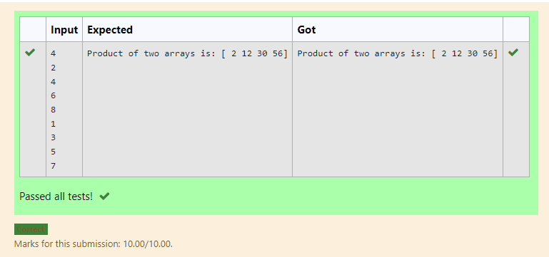

# Multiplying-two-matrix

## AIM:
To write a python program for Multiplying 2-matrices
## ALGORITHM:
### Step 1:
Import numpy as np
### Step 2:
Create 2 empty lists
### Step 3:
Get the input from the user.
### Step 4:
Create a nested for-loop and append the values
### Step 5:
Store the values in a separate variable.
Multiply the values.
## PROGRAM:
``` 
import numpy as np
list1,list2=[],[]
val=int(input())
for i in range(val):
    list1.append(int(input()))
for i in range(val):
    list2.append(int(input()))
value1=np.array(list1)
value2=np.array(list2)
result=value1*value2
print("Product of two arrays is:",result)
```
## OUTPUT:

## RESULT:
Thus the program is written and executed for multiplying 2 matrices

